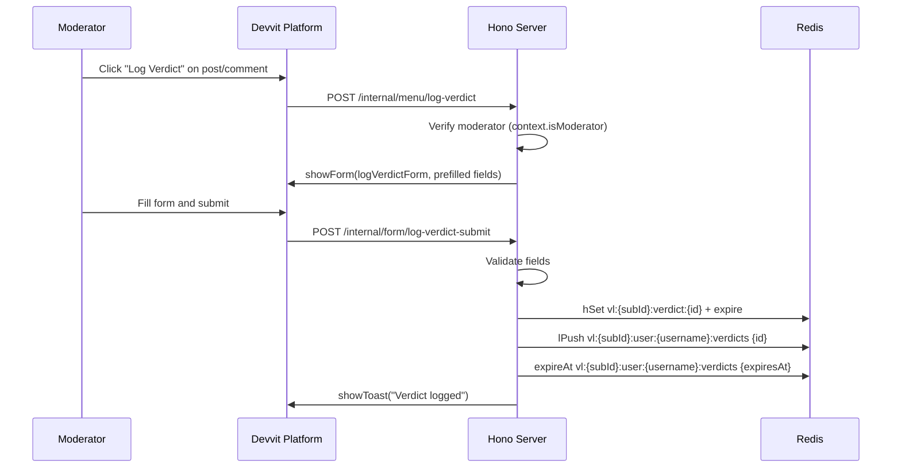
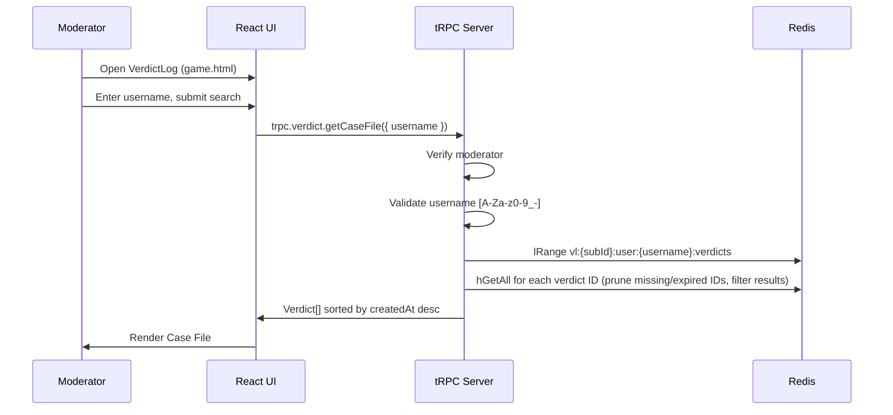

# Design Document — VerdictLog MVP

## Overview

VerdictLog is a Devvit Web application that gives Reddit moderators appeal-ready decision memory. It runs entirely within Reddit via the Devvit platform: menu actions trigger forms and navigate to a React web UI; all data is stored in Redis with TTL-based expiry; all server logic runs in Devvit's serverless Node.js environment.

The design follows the existing project scaffold: Hono handles internal (menu/form/trigger) and API routes; tRPC v11 provides end-to-end type safety for the web UI; React 19 + Tailwind CSS 4 renders the frontend inside a Devvit iFrame.

### Key Design Decisions

- **No tRPC for menu/form endpoints.** Devvit's internal routing (`/internal/menu/*`, `/internal/form/*`) uses plain Hono handlers that return `UiResponse` objects. tRPC is used only for the web UI API (`/api/trpc/*`).
- **Single web UI entrypoint.** The React app (`game.html`) hosts all pages (Case File search, Rule Config, Retention Settings) via client-side routing using a simple page-state pattern rather than a URL router, since `navigateTo` is used for external navigation.
- **Redis key namespacing by subredditId.** All keys are prefixed `vl:{subredditId}:*`. The subredditId is always resolved from the Devvit server context and never accepted from client input.
- **Moderator guard as middleware.** A single Hono middleware and a tRPC procedure middleware both verify moderator status server-side before any handler runs.
- **No body text stored.** The verdict record type explicitly omits any content body field.

---

## Architecture

```mermaid
graph TD
    subgraph Reddit Client
        MC[Mod clicks menu action]
        UI[React Web UI\ngame.html]
    end

    subgraph Devvit Server - Hono
        MR[/internal/menu/*\nMenu handlers]
        FR[/internal/form/*\nForm handlers]
        TR[/internal/triggers/*\nTrigger handlers]
        TRPC[/api/trpc/*\ntRPC router]
        MW[Moderator Auth\nMiddleware]
    end

    subgraph Storage
        RD[(Redis\nvl:{subredditId}:*)]
    end

    subgraph Reddit API
        RA[reddit.*\ngetCurrentUser\ngetCurrentUsername]
    end

    MC -->|POST| MR
    MR -->|showForm / navigateTo| MC
    FR -->|form values| FR
    FR -->|showToast| MC
    UI -->|tRPC calls| TRPC
    TRPC --> MW
    MW --> RD
    MW --> RA
    MR --> RA
    FR --> RD
    TR --> RD
```

### Request Flow — Log Verdict



### Request Flow — Case File Search



---

## Components and Interfaces

### Server Components

```
src/server/
├── index.ts                  # Hono app, route mounting
├── trpc.ts                   # tRPC router + procedure definitions
├── middleware/
│   └── modGuard.ts           # Hono middleware: verify isModerator
├── core/
│   ├── verdict.ts            # createVerdict, deleteVerdict, getCaseFile, getPriorCount
│   ├── rules.ts              # listRules, createRule, updateRule, deleteRule
│   └── settings.ts           # getRetentionSettings, saveRetentionSettings
└── routes/
    ├── api.ts                # /api/trpc/* — tRPC adapter
    ├── menu.ts               # /internal/menu/* — menu action handlers
    ├── forms.ts              # /internal/form/* — form submit handlers
    └── triggers.ts           # /internal/triggers/* — app install
```

### Web UI Components

```
src/web/
├── pages/
│   ├── CaseFilePage.tsx      # Username search + verdict list + copy case file summary
│   ├── RuleConfigPage.tsx    # Rule CRUD interface
│   └── RetentionPage.tsx     # Retention settings form
├── components/
│   ├── VerdictCard.tsx       # Single verdict display with copy/delete actions
│   ├── RuleForm.tsx          # Create/edit rule form
│   ├── SearchBar.tsx         # Username input + submit
│   ├── EmptyState.tsx        # No results message
│   ├── ErrorBanner.tsx       # Error display
│   └── NavBar.tsx            # Page navigation tabs
└── lib/
    ├── trpc.ts               # tRPC client setup
    ├── formatAppealSummary.ts  # Single-verdict appeal summary formatter
    ├── formatCaseFileSummary.ts # All-verdicts case file summary formatter
    ├── formatTimestamp.ts    # YYYY-MM-DD HH:mm UTC formatter
    └── validateUsername.ts   # Client-side username validation
```

### Shared Types

```
src/shared/
├── types.ts                  # Verdict, Rule, RetentionSettings, Severity
└── validation.ts             # Shared validation constants (MAX_REASON_LEN, etc.)
```

---

## Data Models

### Verdict

```typescript
type Severity = 'low' | 'medium' | 'high';
type ContentType = 'post' | 'comment';

type Verdict = {
  id: string;                  // nanoid, e.g. "v_abc123"
  subredditId: string;         // server-resolved, never client-supplied
  subredditName: string;
  username: string;            // moderated user's Reddit username
  authorId?: string;           // Reddit user ID when available
  contentType: ContentType;
  contentId: string;           // Reddit post/comment ID (t3_xxx or t1_xxx)
  permalink: string;           // full Reddit permalink URL
  ruleId: string;              // references Rule.id
  ruleName: string;            // denormalised snapshot at time of logging
  severity: Severity;
  decisionTemplate: string;    // one of the pre-defined template strings
  reason: string;              // free text, max 500 chars, no newlines
  actingMod: string;           // Reddit username of the moderator
  createdAt: number;           // Unix timestamp (ms)
  expiresAt: number;           // Unix timestamp (ms) = createdAt + TTL
};
```

### Rule

```typescript
type Rule = {
  id: string;                  // nanoid
  subredditId: string;
  name: string;                // max 100 chars, unique case-insensitive per subreddit
  description: string;         // max 500 chars, optional
  defaultSeverity: Severity;
  enabled: boolean;
  createdAt: number;
};
```

### RetentionSettings

```typescript
type RetentionSettings = {
  subredditId: string;
  retentionDays: number;       // 1–3650, default 90
  updatedAt: number;
};
```

### Redis Key Schema

All keys are prefixed with `vl:{subredditId}:` to enforce data isolation.

| Key Pattern | Type | Contents | TTL |
|---|---|---|---|
| `vl:{subId}:verdict:{id}` | Hash | All Verdict fields | `retentionDays * 86400s` |
| `vl:{subId}:user:{username}:verdicts` | List | Ordered verdict IDs (prepend on create) | Extended to match the newest verdict's `expiresAt` on each write; stale IDs pruned at read time |
| `vl:{subId}:rules` | Hash | JSON-serialised Rule objects keyed by rule ID | None |
| `vl:{subId}:settings` | Hash | `retentionDays`, `updatedAt` | None |

**Notes:**
- Verdict hashes use `hSet` with individual fields for efficient partial reads.
- The user verdict list is a Redis List with `lPush` (newest first). On each `createVerdict`, after pushing the new ID, the list TTL is extended via `expireAt` to match the new verdict's `expiresAt` (ensuring the index outlives all its verdicts). On read, IDs whose verdict hash is missing or whose `expiresAt` has passed are pruned from the list with `lRem` before returning results.
- Rules are stored as a single hash where each field is a rule ID and the value is the JSON-serialised Rule object. This allows atomic reads of all rules with a single `hGetAll`.
- On verdict deletion, the verdict hash is deleted with `del`; the ID is removed from the user list with `lRem`.

---

## tRPC Router Procedures

The tRPC router is mounted at `/api/trpc` via a Hono adapter. All procedures run through a `modGuard` middleware that verifies `context.isModerator` from `@devvit/web/server`.

```typescript
// src/server/trpc.ts

// Routers
appRouter = {
  verdict: verdictRouter,
  rules: rulesRouter,
  settings: settingsRouter,
}
```

### `verdict` Router

#### `verdict.getCaseFile`

```
Input:  { username: string }
Output: { verdicts: Verdict[] }
Auth:   modGuard (403 if not moderator)
Logic:
  1. Validate username matches /^[A-Za-z0-9_-]+$/
  2. lRange vl:{subId}:user:{username}:verdicts 0 -1
  3. For each ID: hGetAll vl:{subId}:verdict:{id}
  4. Prune: for any ID whose hash is missing or whose expiresAt <= Date.now(), call lRem to remove it from the list
  5. Filter returned verdicts: expiresAt > Date.now()
  6. Sort: createdAt descending
  7. Return filtered, sorted verdicts
Errors:
  - 400 if username invalid
  - 403 if not moderator
  - 500 if Redis fails (no partial results)
```

#### `verdict.delete`

```
Input:  { verdictId: string }
Output: { success: boolean }
Auth:   modGuard (403 if not moderator)
Logic:
  1. hGetAll vl:{subId}:verdict:{verdictId} — fetch the verdict to get username and verify subredditId
  2. If verdict not found, return 404
  3. If verdict.subredditId !== server-resolved subredditId, return 403
  4. del vl:{subId}:verdict:{verdictId}
  5. lRem vl:{subId}:user:{verdict.username}:verdicts 0 {verdictId}
Errors:
  - 404 if verdict not found
  - 403 if not moderator or subredditId mismatch
  - 500 if Redis fails
```

#### `verdict.getPriorCount`

```
Input:  { username: string }
Output: { count: number; mostRecent: { ruleName: string; severity: Severity; createdAt: number } | null }
Auth:   modGuard (403 if not moderator)
Logic:
  1. Validate username
  2. lRange vl:{subId}:user:{username}:verdicts 0 -1
  3. For each ID: hGetAll, filter expiresAt > Date.now()
  4. Return count and the most recent verdict's ruleName, severity, createdAt (or null if none)
Errors:
  - 403 if not moderator
  - 500 if Redis fails
```

### `rules` Router

#### `rules.list`

```
Input:  {}
Output: { rules: Rule[] }
Auth:   modGuard
Logic:
  1. hGetAll vl:{subId}:rules
  2. Parse each value as Rule
  3. Return all rules (enabled and disabled)
```

#### `rules.create`

```
Input:  { name: string, description?: string, defaultSeverity: Severity }
Output: { rule: Rule }
Auth:   modGuard
Logic:
  1. Validate name: non-empty, <= 100 chars
  2. Validate description: <= 500 chars if provided
  3. Check name uniqueness case-insensitively against existing rules
  4. Check rule count < 50
  5. Generate id = nanoid()
  6. hSet vl:{subId}:rules {id} JSON.stringify(rule)
Errors:
  - 400 if validation fails (empty name, too long, duplicate, limit reached)
  - 403 if not moderator
```

#### `rules.update`

```
Input:  { id: string, name?: string, description?: string, defaultSeverity?: Severity, enabled?: boolean }
Output: { rule: Rule }
Auth:   modGuard
Logic:
  1. Fetch existing rule from hGet vl:{subId}:rules {id}
  2. Validate updated fields (same constraints as create)
  3. Check name uniqueness if name is being changed
  4. Merge and persist updated rule
Errors:
  - 404 if rule not found
  - 400 if validation fails
  - 403 if not moderator
```

#### `rules.delete`

```
Input:  { id: string }
Output: { success: boolean }
Auth:   modGuard
Logic:
  1. hDel vl:{subId}:rules {id}
  2. Do NOT touch any verdict records
Errors:
  - 404 if rule not found
  - 403 if not moderator
```

### `settings` Router

#### `settings.get`

```
Input:  {}
Output: { retentionDays: number }
Auth:   modGuard
Logic:
  1. hGet vl:{subId}:settings retentionDays
  2. Return parsed value or default 90
```

#### `settings.save`

```
Input:  { retentionDays: number }
Output: { success: boolean }
Auth:   modGuard
Logic:
  1. Validate retentionDays: integer, 1 <= value <= 3650
  2. hSet vl:{subId}:settings retentionDays {value}
  3. hSet vl:{subId}:settings updatedAt {Date.now()}
  4. Do NOT modify existing verdict TTLs
Errors:
  - 400 if retentionDays out of range (message: "Retention period must be between 1 and 3650 days")
  - 403 if not moderator
```

---

## Menu Action Registration Plan

All menu items use `"forUserType": "moderator"` so Devvit only surfaces them to moderators. The server-side mod guard provides a second layer of verification.

### devvit.json `menu.items` entries

| Label | Location | Endpoint | Context |
|---|---|---|---|
| `Log Verdict` | `post` | `/internal/menu/log-verdict` | post ID, author, permalink |
| `Log Verdict` | `comment` | `/internal/menu/log-verdict` | comment ID, author, permalink |
| `VerdictLog — Search User` | `subreddit` | `/internal/menu/open-search` | subreddit context |
| `VerdictLog — Configure Rules` | `subreddit` | `/internal/menu/open-rules` | subreddit context |
| `VerdictLog — Retention Settings` | `subreddit` | `/internal/menu/open-settings` | subreddit context |

### devvit.json `forms` entries

| Form Key | Endpoint |
|---|---|
| `logVerdictForm` | `/internal/form/log-verdict-submit` |

### Menu Handler Behaviour

**`/internal/menu/log-verdict`** (post and comment locations share one handler; Devvit context distinguishes them):
- Reads `context.postId` / `context.commentId`, `context.authorUsername`, `context.permalink`
- Calls `verdict.getPriorCount({ username })` to fetch the count of non-expired prior verdicts and the most recent verdict's `ruleName`, `severity`, and `createdAt`
- Passes prior verdict data as form context fields: `priorCount`, `priorRuleName`, `priorSeverity`, `priorCreatedAt` (all optional)
- Calls `showForm(logVerdictForm, { username, contentType, contentId, permalink, timestamp, priorCount, priorRuleName, priorSeverity, priorCreatedAt })`
- The form description field renders a prior-verdict banner: if `priorCount > 0`, displays "{priorCount} prior verdict(s) — most recent: {priorRuleName} / {priorSeverity} / {age}"; if `priorCount === 0`, displays "No prior verdicts for this user"

**`/internal/menu/open-search`**, **`/internal/menu/open-rules`**, **`/internal/menu/open-settings`**:
- Each calls `navigateTo` to the game.html URL with a `?page=search|rules|settings` query param so the React app opens on the correct page.

### Log Verdict Form Fields

Defined via Devvit `showForm` API:

| Field | Type | Options / Constraints |
|---|---|---|
| `ruleId` | select | Populated from enabled rules fetched at form-open time |
| `severity` | select | `low`, `medium`, `high` |
| `decisionTemplate` | select | "Repeated violation after prior warning", "Good-faith mistake — educational removal", "Spam pattern across multiple posts", "Escalated behavior after temp ban", "Off-topic — redirected to appropriate subreddit", "Inflammatory or bad-faith engagement", "Custom" |
| `reason` | text | Max 500 chars, no newlines, required |

Hidden pre-filled fields passed as form context: `username`, `contentType`, `contentId`, `permalink`, `timestamp`.

---

## Appeal Summary Format Specification

The `formatAppealSummary` function in `src/web/lib/formatAppealSummary.ts` produces the following fixed plain-text layout. Each field is on its own line; a blank line separates the header block from the content block.

```
VerdictLog Appeal Summary
Subreddit: r/{subredditName}
User: u/{username}

Content: {contentType} — {permalink}
Rule: {ruleName}
Severity: {severity}
Decision: {decisionTemplate}
Reason: {reason}
Acting Mod: u/{actingMod}
Date: {createdAt formatted as YYYY-MM-DD HH:mm UTC}
```

**Rules:**
- `{contentType}` is the literal string `post` or `comment`.
- `{createdAt}` is formatted using UTC: `new Date(createdAt).toISOString().slice(0, 16).replace('T', ' ') + ' UTC'`.
- The function accepts a `Verdict` object and returns a `string`. It has no side effects.
- The output MUST NOT include any post or comment body text.
- The clipboard write is performed by the `VerdictCard` component using `navigator.clipboard.writeText(summary)`. On success, `showToast("Appeal summary copied to clipboard")` is called. On failure, the summary is displayed in a read-only `<textarea>` within the card.

---

## Case File Summary Format Specification

The `formatCaseFileSummary` function in `src/web/lib/formatCaseFileSummary.ts` produces a single plain-text block containing all visible verdicts for a user. It accepts `(subredditName: string, username: string, verdicts: Verdict[])` and returns a `string`. It has no side effects and MUST NOT include any post or comment body text.

```
VerdictLog Case File
Subreddit: r/{subredditName}
User: u/{username}
Verdicts: {count}

--- Verdict 1 ---
Content: {contentType} — {permalink}
Rule: {ruleName}
Severity: {severity}
Decision: {decisionTemplate}
Reason: {reason}
Acting Mod: u/{actingMod}
Date: {createdAt formatted as YYYY-MM-DD HH:mm UTC}

--- Verdict 2 ---
...
```

Verdicts are written in the same reverse-chronological order they appear in the Case File View (most recent first). The clipboard write is performed by `CaseFilePage` using `navigator.clipboard.writeText(summary)`. On success, `showToast("Case file copied to clipboard")` is called. On failure, the summary is displayed in a read-only `<textarea>` that remains visible until dismissed.

---

## Correctness Properties

*A property is a characteristic or behavior that should hold true across all valid executions of a system — essentially, a formal statement about what the system should do. Properties serve as the bridge between human-readable specifications and machine-verifiable correctness guarantees.*

This feature is well-suited for property-based testing. The core logic — validation functions, data transformations, filtering, sorting, and formatting — consists of pure functions with clear input/output behaviour and large input spaces where varied inputs reveal edge cases. The property-based testing library used is **[fast-check](https://fast-check.dev/)** (TypeScript-native, no additional runtime dependencies).

---

### Property 1: Reason validation rejects oversized or multiline strings

*For any* string with length greater than 500 characters, or any string containing one or more newline characters (`\n` or `\r`), the reason validation function SHALL return an error result and SHALL NOT accept the input as valid.

**Validates: Requirements 1.6**

---

### Property 2: Reason validation accepts valid strings

*For any* non-empty string with length ≤ 500 characters and no newline characters, the reason validation function SHALL return a success result.

**Validates: Requirements 1.6**

---

### Property 3: Verdict storage round-trip preserves all required fields

*For any* valid verdict input (with all required fields present and valid), storing the verdict and then retrieving it by ID SHALL produce a record where every required field (`id`, `subredditId`, `subredditName`, `username`, `contentType`, `contentId`, `permalink`, `ruleId`, `ruleName`, `severity`, `decisionTemplate`, `reason`, `actingMod`, `createdAt`, `expiresAt`) matches the original input.

**Validates: Requirements 1.7**

---

### Property 4: Stored verdicts never contain body text

*For any* verdict stored via the create verdict function, the resulting Redis hash SHALL NOT contain a field named `body`, `text`, `content`, `postBody`, or `commentBody`.

**Validates: Requirements 1.10**

---

### Property 5: TTL computation is correct for any retentionDays value

*For any* positive integer `retentionDays` in the range [1, 3650], the computed `expiresAt` value SHALL equal `createdAt + retentionDays * 86400 * 1000` (milliseconds). When `retentionDays` is absent, the computed `expiresAt` SHALL equal `createdAt + 90 * 86400 * 1000`.

**Validates: Requirements 1.8**

---

### Property 6: Username validation rejects invalid characters and empty input

*For any* string that is empty or contains at least one character outside the set `[A-Za-z0-9_-]`, the username validation function SHALL return an error result.

**Validates: Requirements 2.2**

---

### Property 7: Username validation accepts valid Reddit usernames

*For any* non-empty string composed entirely of characters from `[A-Za-z0-9_-]`, the username validation function SHALL return a success result.

**Validates: Requirements 2.2**

---

### Property 8: Case file results are sorted in reverse-chronological order

*For any* non-empty list of verdicts with distinct `createdAt` timestamps, the sort function SHALL produce a list where for every adjacent pair `(verdicts[i], verdicts[i+1])`, `verdicts[i].createdAt >= verdicts[i+1].createdAt`.

**Validates: Requirements 2.4**

---

### Property 9: Expired verdict filter excludes all expired records

*For any* list of verdicts with varying `expiresAt` values and a given reference time `now`, the filter function SHALL return only verdicts where `expiresAt > now`, and SHALL exclude all verdicts where `expiresAt <= now`.

**Validates: Requirements 2.7**

---

### Property 10: Appeal summary contains all required fields for any verdict

*For any* valid `Verdict` object, the `formatAppealSummary` function SHALL return a string that contains the subreddit name, username, content type, permalink, rule name, severity, decision template, reason, acting mod username, and the creation timestamp formatted as `YYYY-MM-DD HH:mm UTC`.

**Validates: Requirements 3.2**

---

### Property 11: Rule selector contains exactly the enabled rules

*For any* list of rules (with any mix of enabled and disabled), the function that filters rules for the Log Verdict form selector SHALL return exactly the rules where `enabled === true`, and SHALL NOT include any rule where `enabled === false`.

**Validates: Requirements 1.3, 4.5**

---

### Property 12: Rule name validation rejects empty names and names exceeding 100 characters

*For any* rule name that is empty or has length greater than 100 characters, the rule name validation function SHALL return an error result.

**Validates: Requirements 4.3, 4.9**

---

### Property 13: Rule name uniqueness check is case-insensitive

*For any* existing rule set and any candidate rule name whose lowercase form matches the lowercase form of any existing rule's name, the uniqueness check SHALL return a conflict error and SHALL NOT allow the rule to be created.

**Validates: Requirements 4.7**

---

### Property 14: Rule deletion does not affect verdicts

*For any* rule ID and any set of verdicts that reference that rule ID in their `ruleId` field, deleting the rule SHALL leave all verdict records unchanged (same fields, same TTL).

**Validates: Requirements 4.6**

---

### Property 15: Retention days validation rejects out-of-range values

*For any* integer outside the range [1, 3650] (including zero, negative values, and values greater than 3650), the retention days validation function SHALL return an error result with the message "Retention period must be between 1 and 3650 days".

**Validates: Requirements 5.2, 5.6**

---

### Property 16: Retention days validation accepts all in-range values

*For any* integer in the range [1, 3650] inclusive, the retention days validation function SHALL return a success result.

**Validates: Requirements 5.2**

---

### Property 17: Verdict deletion removes the record and its list entry

*For any* verdict ID that exists in Redis, after calling the delete function, querying `vl:{subId}:verdict:{id}` SHALL return null, and the ID SHALL NOT appear in `vl:{subId}:user:{username}:verdicts`.

**Validates: Requirements 6.4**

---

### Property 18: All endpoints return 403 for non-moderator callers

*For any* tRPC procedure or Hono route in VerdictLog, calling it with a Devvit context where `isModerator` is `false` SHALL return an HTTP 403 response and SHALL NOT return any verdict, rule, or settings data.

**Validates: Requirements 7.3, 7.4**

---

### Property 19: All Redis keys are namespaced by server-resolved subredditId

*For any* Redis write operation performed by VerdictLog, the resulting key SHALL begin with the prefix `vl:{subredditId}:` where `subredditId` is the value from the Devvit server context, and SHALL NOT use any subredditId value supplied by the client request body.

**Validates: Requirements 8.1**

---

### Property 20: Case file search returns only verdicts for the queried subreddit

*For any* username search, all returned verdicts SHALL have a `subredditId` field equal to the server-resolved `subredditId` of the current request, and SHALL NOT include verdicts from any other subreddit.

**Validates: Requirements 8.2**

---

### Property 21: User verdict index TTL is extended to the newest verdict's expiresAt on each create

*For any* call to `createVerdict`, after the verdict hash and list entry are written, the TTL of `vl:{subId}:user:{username}:verdicts` SHALL be greater than or equal to the new verdict's `expiresAt` (converted to seconds from epoch), ensuring the index key does not expire before the verdict it references.

**Validates: Requirements — user index TTL (design)**

---

### Property 22: Case file summary contains all required fields for every verdict in the list

*For any* non-empty list of valid `Verdict` objects, the `formatCaseFileSummary` function SHALL return a string that contains, for each verdict, the subreddit name, username, content type, permalink, rule name, severity, decision template, reason, acting mod username, and creation timestamp formatted as `YYYY-MM-DD HH:mm UTC`; and SHALL NOT contain any post or comment body text.

**Validates: Requirements 3.7, 3.8**

---

## Error Handling

### Validation Errors

All validation is performed server-side before any Redis operation. Validation errors return HTTP 400 (tRPC `BAD_REQUEST`) with a human-readable message identifying the failing field. The client displays these via `showToast` (for form submissions) or inline error banners (for the web UI).

### Access Control Errors

The `modGuard` middleware runs before every handler. If `context.isModerator` is falsy, it returns HTTP 403 immediately. The web UI checks moderator status on mount and renders an "Access denied" screen if the check fails.

### Redis Errors

- **Read failures**: The tRPC procedure catches the error, logs it, and throws a `INTERNAL_SERVER_ERROR`. The client displays an error banner and does not render partial data.
- **Write failures**: The handler catches the error and returns an error toast response. No partial writes are committed.
- **Delete failures**: The handler returns an error toast; the verdict record is retained.

### Form Validation Errors

Devvit forms validate required fields before submission. Additional server-side validation in the form submit handler returns `showToast` with the error message if validation fails.

---

## Testing Strategy

### Unit Tests (example-based)

Focus on specific behaviours, integration points, and error conditions:

- Menu handler returns correct pre-filled form fields for post and comment contexts
- Menu handler `/log-verdict` includes prior verdict count and most-recent verdict data in form context
- Form submit handler returns `showToast` on success and on validation failure
- `formatAppealSummary` produces the exact fixed layout for a known verdict
- `formatCaseFileSummary` produces the correct multi-verdict layout for a known verdict list
- `formatTimestamp` produces `YYYY-MM-DD HH:mm UTC` for known timestamps
- `settings.get` returns 90 when no value is configured
- `settings.get` returns the configured value when one exists
- `verdict.getCaseFile` returns an error response when Redis throws
- `deleteVerdict` fetches the verdict to resolve username before deleting
- `deleteVerdict` returns 403 when stored `subredditId` does not match server context
- Non-moderator context returns 403 from any endpoint
- Clipboard success shows toast; clipboard failure shows fallback textarea

### Property-Based Tests (fast-check)

Each property listed in the Correctness Properties section is implemented as a single fast-check property test with a minimum of 100 iterations. Tests are tagged with a comment in the format:

```
// Feature: verdictlog-mvp, Property {N}: {property title}
```

Property tests cover:
- Reason validation (Properties 1, 2)
- Verdict storage round-trip (Property 3)
- No body text in stored verdicts (Property 4)
- TTL computation (Property 5)
- Username validation (Properties 6, 7)
- Case file sort order (Property 8)
- Expired verdict filtering (Property 9)
- Appeal summary format completeness (Property 10)
- Rule selector filtering (Property 11)
- Rule name validation (Properties 12, 13)
- Rule deletion isolation (Property 14)
- Retention days validation (Properties 15, 16)
- Verdict deletion round-trip (Property 17)
- Access control (Property 18)
- Redis key namespacing (Property 19)
- Subreddit data isolation (Property 20)
- User index TTL extension on create (Property 21)
- Case file summary completeness (Property 22)

### Integration Tests

- Redis TTL expiry removes verdict key (verifies Requirement 5.4)
- User verdict index key TTL is set correctly after `createVerdict`

### Test Configuration

- Test runner: Vitest (already in project ecosystem via `npm run test`)
- PBT library: fast-check (`npm install --save-dev fast-check`)
- Minimum iterations per property test: 100
- Pure functions (validators, formatters, sorters, filters) are tested in isolation without Redis mocks
- Redis-dependent properties use an in-memory Redis mock
